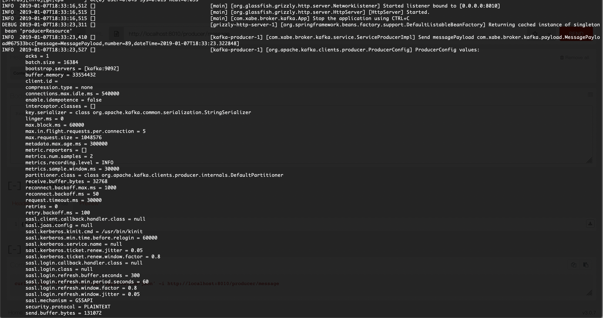

# Este microservicio se encarga de producir un mensage a kafka

En microservico se encarga de publicar un mesage en el topic de test de kafka cuando invocamos a un endpoint


 ### Como compilar

Lo primero es generar nuestra image de docker con nuestro microservicio
 
```
mvn clean install -Pdocker
```

### Como arrancar

Vamos a usar docker lo primero que tenemos que hacer es arrancar nuestro servico de zoopeeker y kafka con el siguiente comando:


```
docker run --rm -d --name zookeeper --hostname zookeeper -p 2181:2181 wurstmeister/zookeeper

docker run --rm -d --name kafka --hostname kafka --link zookeeper:zookeeper -p 9092:9092 -e KAFKA_ADVERTISED_HOST_NAME=kafka -e KAFKA_ADVERTISED_PORT=9092 -e KAFKA_CREATE_TOPICS=test:1:1  -e KAFKA_ZOOKEEPER_CONNECT=zookeeper:2181 wurstmeister/kafka:2.12-2.1.0
```

Con esto ya tenemos nuestro kafka arrancado


Lo siguente arrancar nuestro microservicio pero **linkando** con nuestro broker

```
docker run --rm --name producer --link kafka:kafka -p 8010:8010 xabe/broker-kafka-producer
```

### Como crear un evento

```

curl -X POST -h "content-type: application/json" http://localhost:8010/producer/message

```

