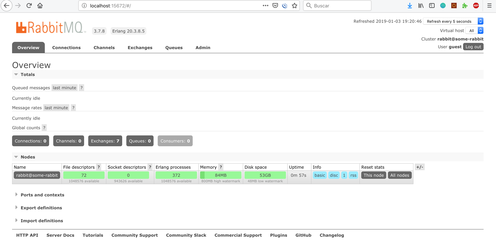
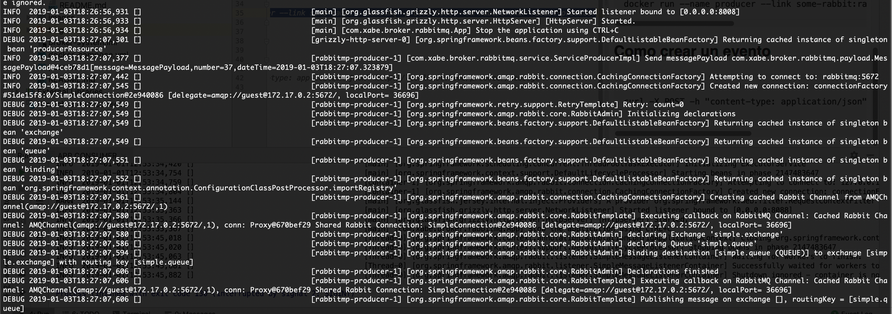

# Este microservicio se encarga de producir un mensage a rabbitmq

En microservico se encarga de publicar un mesage en la cola rabbitmq cuando invocamos a un endpoint


 ### Como compilar

Lo primero es generar nuestra image de docker con nuestro microservicio
 
```
mvn clean install -Pdocker
```

### Como arrancar

Vamos a usar docker lo primero que tenemos que hacer es arrancar nuestro servico de rabbitmq con el siguiente comando:


```
docker run -d --hostname some-rabbit --name some-rabbit -e RABBITMQ_DEFAULT_USER=guest -e RABBITMQ_DEFAULT_PASS=guest -p 15672:15672 -p 5672:5672 --rm rabbitmq:3-management 

```

Con esto ya tenemos nuestro rabbit arrancado podemos comprobarlo entrando a la consola de administracion

```
http://localhost:15672
```



Lo siguente arrancar nuestro microservicio pero **linkando** con nuestro broker

```
docker run --name producer --link some-rabbit:rabbitmq -p 8008:8008 --rm xabe/broker-rabbit-producer
```

### Como crear un evento

```

curl -X POST -h "content-type: application/json" http://localhost:8008/producer/message

```

